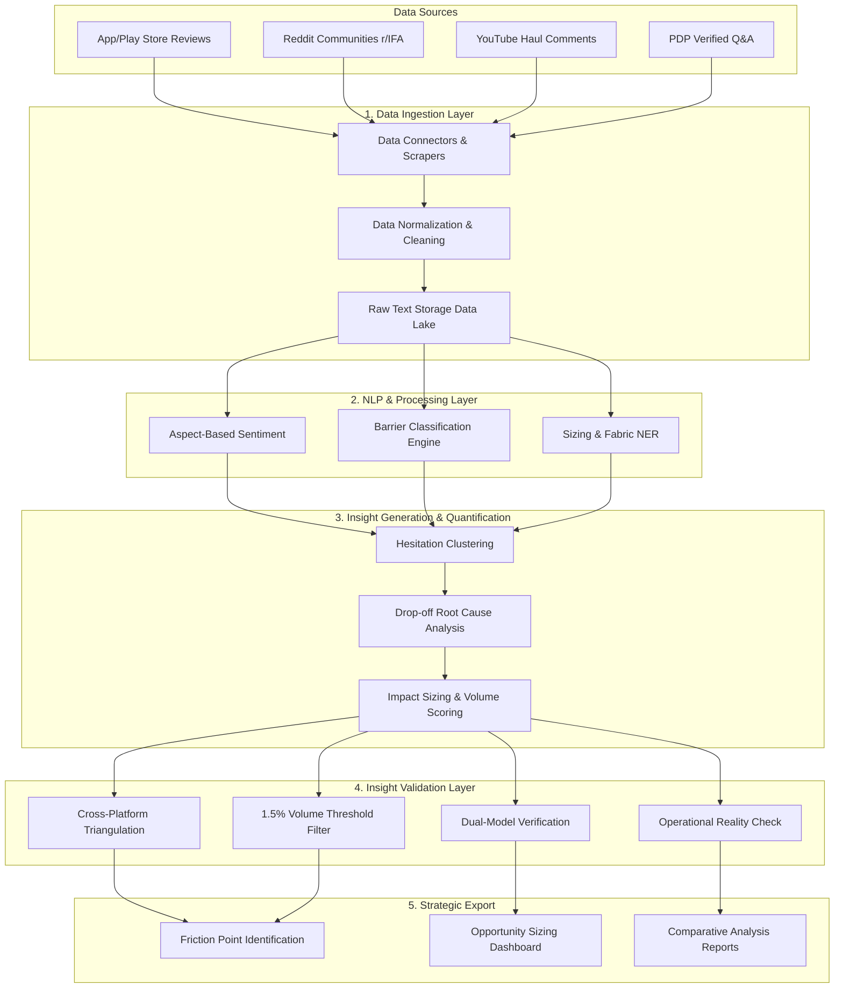

# Nykaa Fashion Discovery Engine: System Architecture

## 1. High-Level Architecture Overview

The Nykaa Fashion Discovery Engine is designed as a multi-stage data processing pipeline. It ingests unstructured text from diverse fashion communities and customer feedback channels, processes it using advanced NLP, and outputs quantified, validated strategic insights.

## 2. Component Breakdown

### 2.1 Data Ingestion Layer
This layer is responsible for gathering unstructured data from multiple off-platform and on-platform sources.
- **Connectors & APIs:** Automated pipelines pulling data from App Store, Google Play Store, Reddit (e.g., `r/IndianFashionAddicts`, `r/IndianBeautyDeals`), and YouTube APIs.
- **Normalization:** Cleansing raw text (removing emojis, correcting spelling, standardizing fashion terminology).
- **Storage:** Storing raw and pre-processed text in a scalable Data Lake for batch processing.

### 2.2 NLP & Processing Layer
The core AI processing layer that transforms raw text into structured attributes.
- **Aspect-Based Sentiment Analysis (ABSA):** Identifies specific product aspects (e.g., "fabric", "zipper", "length") and assigns sentiment scores to each, going beyond generic review sentiment.
- **Barrier Classification:** Categorizes identified issues into core barrier types:
    - Fit, Fabric & Drape Uncertainty
    - Choice Paralysis & Comparison Friction
    - Styling Ambiguity
    - Taxonomy & Segment Intent Disconnect
- **Sizing & Fabric NER:** Uses Named Entity Recognition to extract specific physical attributes mentioned by users (e.g., "5'4 height", "bust size", "cotton blend").

### 2.3 Insight Generation & Opportunity Quantification
This layer aggregates processed data to find meaningful patterns and sizes their business impact.
- **Hesitation Clustering:** Groups similar complaints and doubts using embedding-based clustering to identify emerging trends.
- **Root Cause Analysis:** Maps clustered hesitations to specific points in the user journey (e.g., dropping off at the wishlist stage vs. checkout).
- **Opportunity Sizing:** Assigns a statistical weight to each barrier based on occurrence volume, allowing product teams to prioritize fixes based on potential GMV impact.

### 2.4 Insight Validation Layer (Quality Control)
To prevent AI hallucinations and ensure statistical significance, all insights must pass through four strict checkpoints:
1. **Cross-Platform Triangulation:** Insights must be validated across at least two independent data streams (e.g., a Reddit complaint must also appear in Play Store reviews).
2. **The 1.5% Volume Threshold:** Filtering out edge cases; a friction point must represent at least 1.5% of total categorized feedback to be flagged.
3. **Dual-Model Verification:** A two-tier Large Language Model (LLM) architecture. An *extractive* model pulls raw quotes, while a *secondary evaluator* model checks the synthesis to ensure no external hallucinations were introduced.
4. **Operational Reality Check:** Cross-referencing qualitative text insights with internal Nykaa platform metrics (e.g., mapping user doubts about "fabric sheer" to actual return/exchange rates for that category).

## 3. Output & Export (Strategic Intelligence)
The final stage exports the validated data into actionable formats for the product and growth teams:
- **Friction Point Dashboards:** Clear visualization of why users are hesitating.
- **Prioritization Matrices:** Opportunities ranked by their quantified impact on the 30-day wishlist conversion metric.
- **Segment Benchmarking:** Comparative analysis across different user cohorts (e.g., Gen-Z Trend Hunters vs. Premium Occasion Shoppers).
